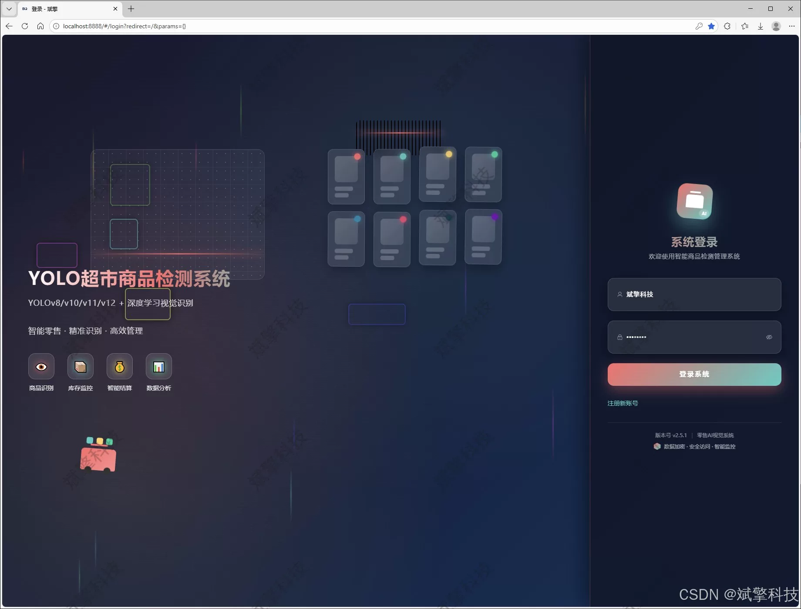
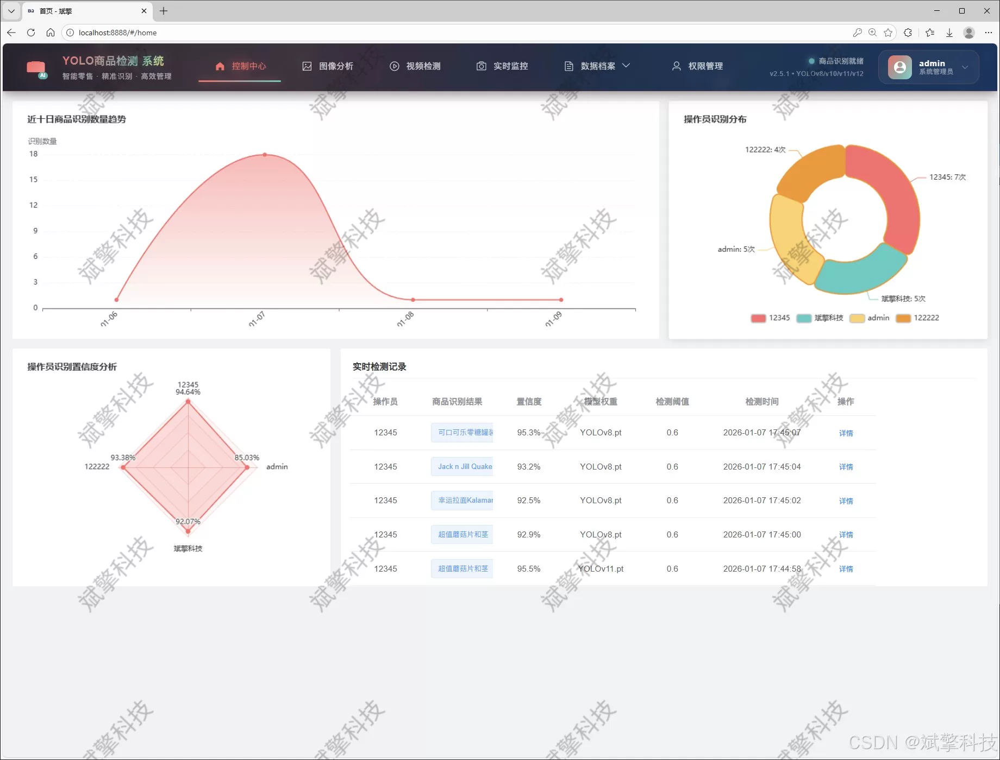
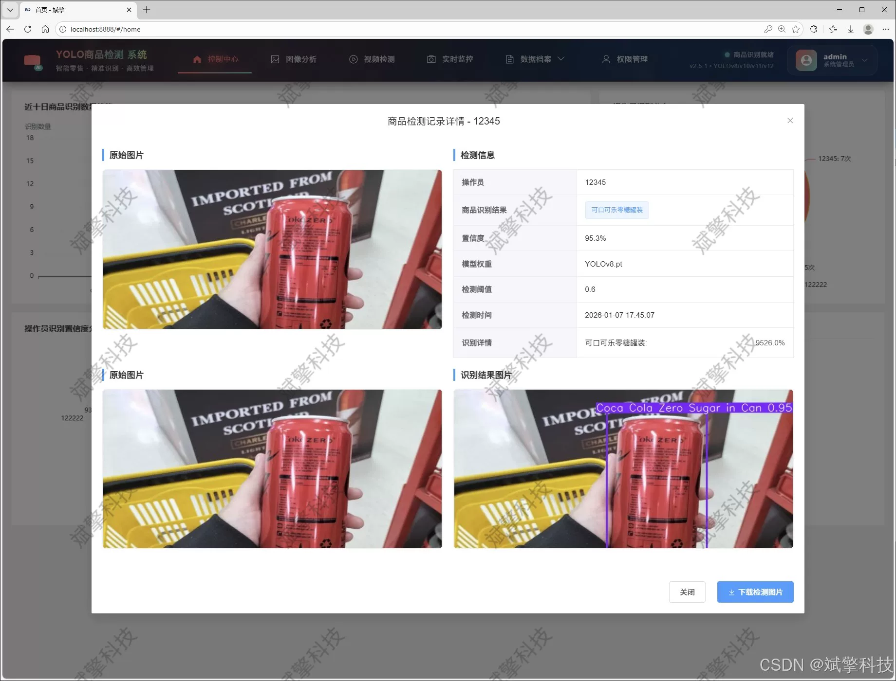
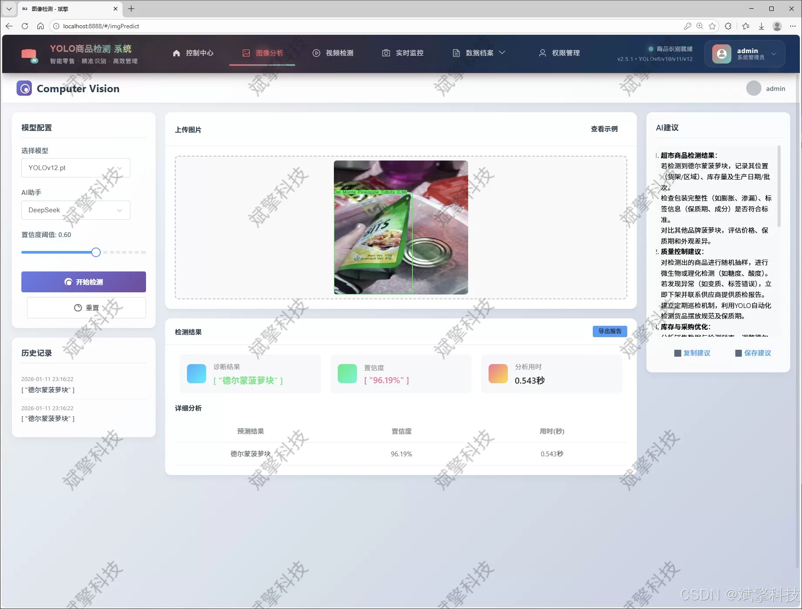
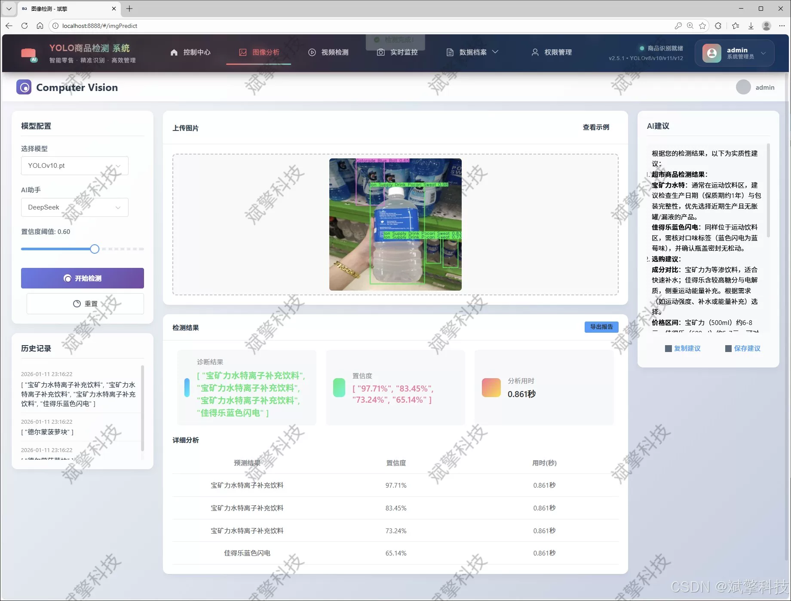
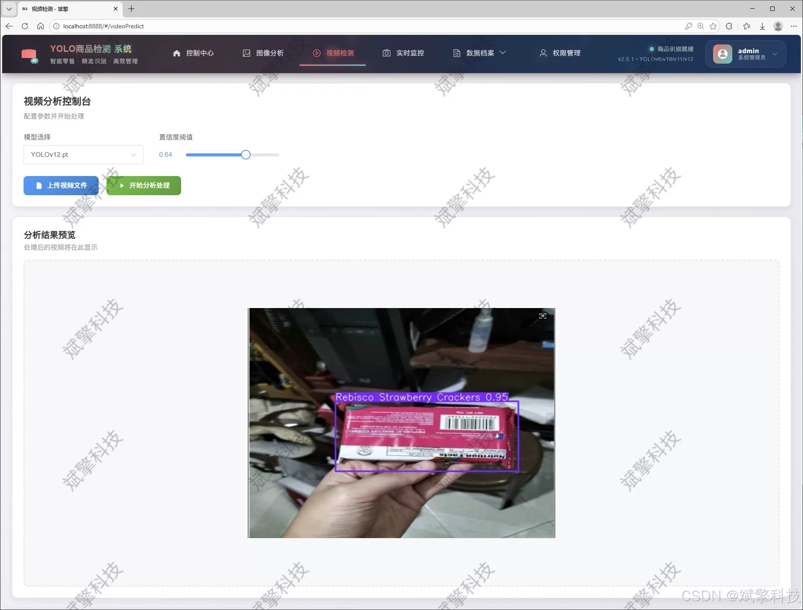
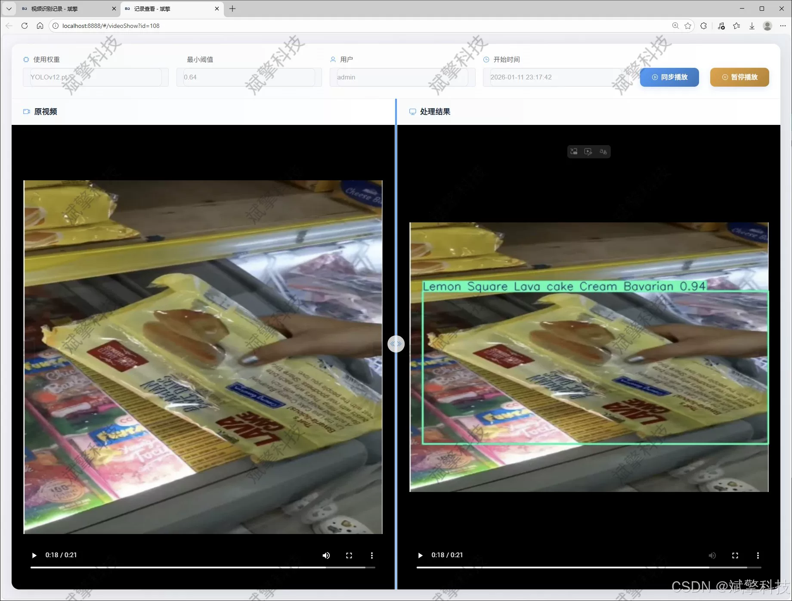
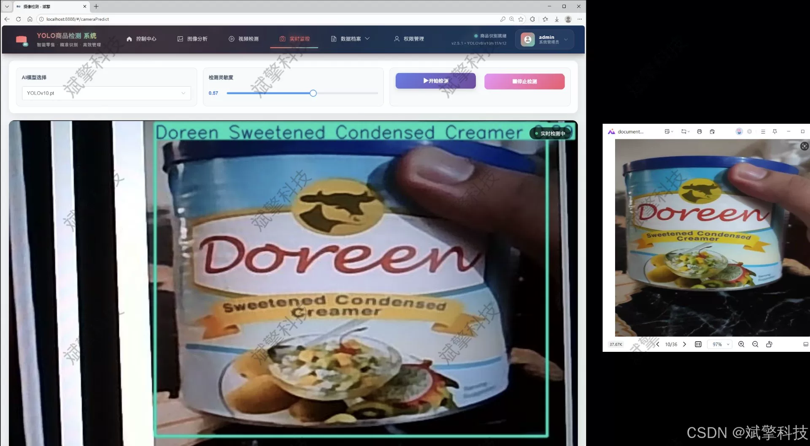
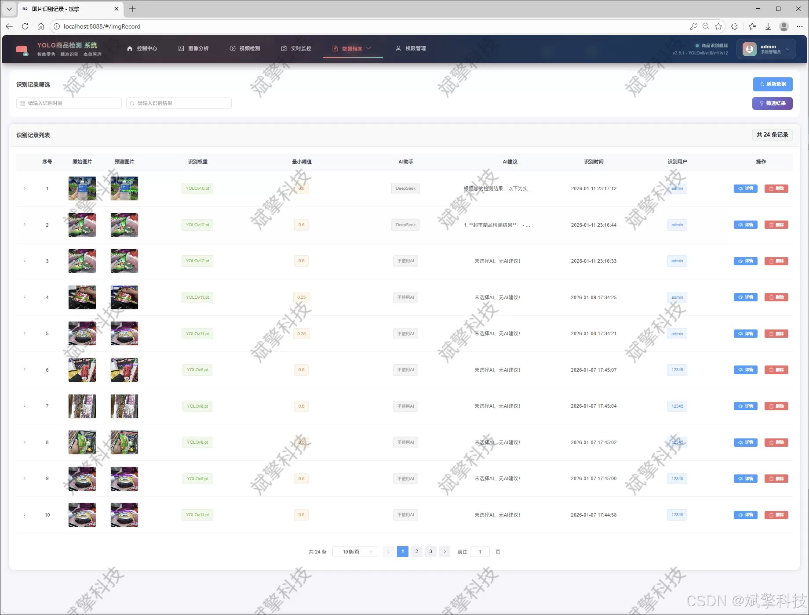

# YOLO Multi-Model Intelligent Product Recognition System

## Body

The YOLO Multi-Model Intelligent Product Recognition System is based on the YOLO deep learning and the large models of Qianwen and DeepSeek. The supermarket product recognition detection system (DeepSeek intelligent analysis + web interaction interface + front-end separation + YOLO data + YOLOv8/YOLOv10/YOLOv11/YOLOv12)

The project aims to design and implement an efficient, accurate, and user-friendly smart supermarket product recognition detection system. The system integrates cutting-edge computer vision technology with modern Web development frameworks to address the automation recognition and management needs of a large number of diverse products in retail scenarios. The core of the system utilizes mainstream target detection models such as YOLOv8, YOLOv10, YOLOv11, and YOLOv12, which have excellent performance, to build a specialized recognition engine for 295 common supermarket products. This engine covers categories such as beverages, condiments, daily necessities, etc., and has been thoroughly trained and validated on a dataset containing over ten thousand images. The backend service is built based on the SpringBoot framework, adopting a front-end-back-end separation architecture model to ensure the system's scalability and maintainability. The front end provides rich features through an interactive web interface, including product detection using multi-format media (images, videos, real-time camera streams), visualization of detection results, and historical record management. The system innovatively integrates the DeepSeek large language model to provide intelligent product analysis, description, or nutritional information interpretation for the detection results.

Furthermore, the system has also implemented a complete user identity authentication and permission management system. Administrators can manage users and detection data comprehensively. This system not only validates the practical performance of the latest YOLO series model in complex retail environments, but also provides a software solution prototype with comprehensive functions and advanced technical stack for smart retail, unmanned settlement, inventory inventory and consumer behavior analysis applications.

Functional module

✅ User Login and Registration: Supports password detection, saves to MySQL database.

✅ Supports four YOLO model switches, YOLOv8, YOLOv10, YOLOv11, YOLOv12.

✅ Information Visualization, Data Visualization.

✅ Image detection supports AI analysis functions, deepseek and Qianwen.

✅ Supports image detection, video detection, and real-time camera detection. The results are saved to a MySQL database.

✅ Picture recognition record management, video recognition record management and camera recognition record management.

✅ User Management Module, administrators can add, delete, modify, and query users.

✅ Personal center, can modify their own information, password name profile picture and so on.

There is no Lunwen writing service, nor any Lunwen.

## Images

## Payment

Here is a pay link on Stripe ( https://buy.stripe.com/3cs8yP7sY87d0vu9AB ). Please contact me lonlonago@foxmail.com after funding $89, and I will send you a complete data files , thank you!

